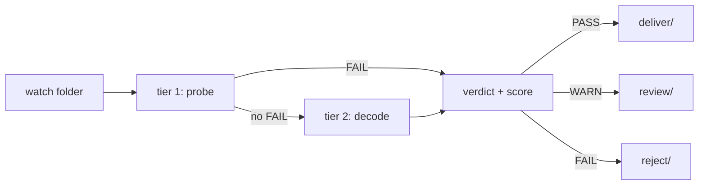

My safety-net series checks files you *name*. `aivideosentry gate hero.mp4`. The problem is the files you forget to name. The one that rendered overnight while I slept, passed a glance at the thumbnail, and almost went to the client with five seconds of frozen tail on the end.

So I built the last mile: a daemon. You point it at a folder. Every render that lands there gets probed, decoded, judged, and routed before any human has to remember anything. [AIVideoSentry](https://github.com/madebysaira/AIVideoSentry) — Python 3.10+, zero third-party dependencies, ffmpeg on PATH, nothing else.


## The shape of it

Two tiers, cheapest first. Tier 1 is ffprobe metadata: resolution, duration, fps, codec, container, audio, bitrate — milliseconds per file. Tier 2 only runs when tier 1 did not already fail: it actually decodes the file through ffmpeg's `blackdetect` and `freezedetect` filters to catch black frames and frozen footage. A verdict engine scores everything (100 minus 25 per failure, 8 per warning) and the file is routed — `deliver/`, `review/`, `reject/` — with an atomic JSON report beside it. The gate command is CI-friendly: exit 0/1/2/3 for PASS/WARN/FAIL/error.



## The bug worth writing about

I audit my own tools with fresh eyes before shipping, and this audit found a real one.

Here is the failure mode every AI video person knows: the generator stalls near the end, and the last rendered frame gets cloned to end-of-file. The video "finishes." Duration looks right. Thumbnail looks right. The tail is a dead frame.

I assumed freezedetect would catch it. It doesn't — and the reason is a genuine ffmpeg quirk. freezedetect only prints `freeze_duration` when a freeze *ends* mid-stream. A freeze that runs to end-of-file never gets its end marker, so the log shows a lone `freeze_start` and nothing else. I proved it on the bench: a real 8-second clip, 3 seconds of motion then 5 seconds of cloned tail, sailed through my own QC as a clean PASS.

The fix is reconstruction. When the parser sees an orphan `freeze_start` with no duration, Sentry pairs it with the real video duration — frame count divided by frame rate, so a short audio track can't shrink the answer — and rebuilds the event. That stalled render now fails with `freeze event 2.96s..8.00s (5.04s) (ran to end of file)` and lands in `reject/` where it belongs.


Two more defects went out in the same release. Same-name re-deliveries used to silently overwrite the earlier file in `deliver/`; now they get a `-2`, `-3` suffix so nothing is ever destroyed. And the freeze thresholds were hard-coded constants; they're proper rule fields now (`freeze_min_s`, `freeze_fail_s`), overridable per run like every other threshold: `--rule freeze_fail_s=3`.

## The tests are the story

Every test runs against real ffmpeg-generated fixtures — a clean render, a broken one, a frozen-tail one, a black-tail one. The frozen-tail test is the one that matters: it only passes if the orphan-start reconstruction actually works, because freezedetect will never hand you that duration. The old test suite never caught this because the old frozen fixture was silently unusable (it failed tier-1 on a missing audio track, so tier-2 never ran at all). Fixtures that exercise nothing are worse than no fixtures — they give you green and a false story.

25 tests now, up from 19. The release tag runs them all before push, plus a fresh-venv install from the built wheel with an end-to-end `watch --once` cycle: good render to `deliver/`, stalled render to `reject/`, JSON report with reasons either way.

## Where it sits in the series

- [AIVideoCreditGuard](https://github.com/madebysaira/AIVideoCreditGuard) — API spend guard
- [AIVideoQualityGate](https://github.com/madebysaira/AIVideoQualityGate) — batch QC
- [AIVideoAdherenceGate](https://github.com/madebysaira/AIVideoAdherenceGate) — prompt-contract checking
- [AIVideoBatchQueue](https://github.com/madebysaira/AIVideoBatchQueue) — render queue
- [ComfyUI-VideoGate](https://github.com/madebysaira/ComfyUI-VideoGate) — QC nodes inside ComfyUI

Sentry is the hands-off glue. The others check what you tell them to; this one watches the folder where renders land, so the check happens whether or not anyone remembered.

```console
$ pip install git+https://github.com/madebysaira/AIVideoSentry.git
$ aivideosentry watch ~/renders/inbound
```

MIT, as always. If a frozen tail ever reached a client of yours, this is the daemon that ends that.
